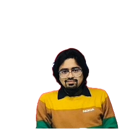
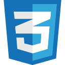

<!--markdown-->
#Hi, I am Sumit Sarkar  
--- 
### Frontend web Developer
#### 🏠 lived in Dhaka, Bangladesh
 

[][facebooklink]
[][linkedinlink]
[][gmaillink]

 __About me__ [][cvlink]

My expertise lies in coding languages like HTML, CSS, and JavaScript, and I'm also comfortable with frameworks like Bootstrap and React. I focus on creating user-friendly and visually appealing interfaces that make navigating websites a breeze.

 

- 💼 I’m currently working on  __Codeman BD__.
- 🌱 I’m currently learning and practise __ReactJS__.
- 👯 I’m looking to collaborate on __GitHub__.
- 📝 Expert on `Lead generation`
- 📝 Expert on `ReactJS`
- 💬 Ask me about `HTML, CSS, Bootstrap, Tailwind and JavaScript`.

 

### __SKILL & Expertise__:

  
 

 

 

 

  
 
 

  
 

###  __Activities / Hobby__:
- ♟️Chess,  🎨 Painting, 🎸 Playing Guiter, 📚 Books 
 

### __Education__:
1. __Codeman BD__
    - Creative Frontend Development (2023-2024)
2. __Infobase computer center__
    - ICT & computer programming (2012-2013)
3. __University of Development Alternative (UODA)__
    - Bachelor of Business Administration (2009-2015)

     

    https://github.com/SUMITSARKAR89/sumitsarkar89/assets/127943920/c03980ec-0eb9-403b-8f74-c26ad5a9ed6d

    
   ### __"There is no friend as loyal as a book"__ 

 
All rights reserved by Sumit sarkar @2022

<!-- --link-- -->
[facebooklink]: https://www.facebook.com/sumitsarkar89
[behancelink]:https://www.behance.net/sumitsarkar89
[linkedinlink]:https://www.linkedin.com/in/sumitsarkar89/
[gmaillink]: www.sumitopticalit89@gmail.com
[githublink]: https://github.com/SUMITSARKAR89
[cvlink]:https://drive.google.com/file/d/1CTEwnPjn2WZW2E9qf5NDFViXcVLVEMD-/view?usp=drive_link

